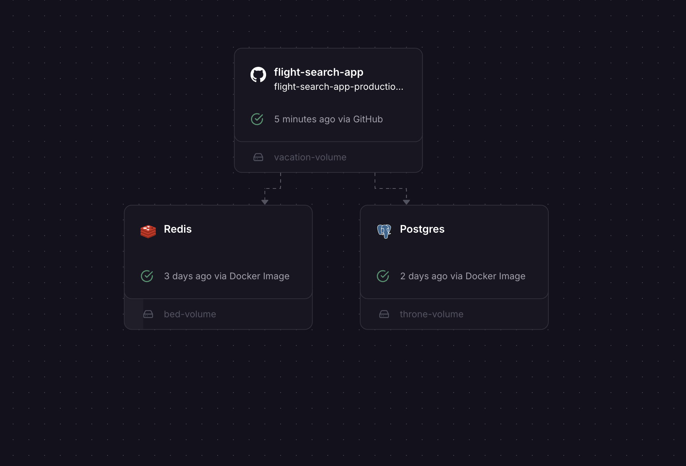

# ✈️ Flight Search Application

A modern flight search web application built with [Next.js](https://nextjs.org), allowing users to search, view, and filter available flights between airports. Inspired by platforms like Alibaba Travel and Booking.com, it includes authentication, (filtering, sorting, -> coming soon) and responsive UI features.

## 🚀 Tech Stack

- **Framework**: Next.js (with App Router & Server Components)
- **Styling**: Tailwind CSS
- **Database**: Drizzle ORM (PostgreSQL), Redis
- **Authentication**: NextAuth.js
- **Testing**:
  - Unit: Jest + React Testing Library
  - E2E: Cypress
- **Dev Tools**: SWR, react-hook-form, date-fns

## 🧑‍💻 Features

### ✈️ Flight Search

- Search flights between airports using IATA codes
- Select departure and optional return dates
- Specify number of passengers
- Prevent past date searches (coming soon)

### 📋 Results Page

- View airline name, departure/arrival times, duration, and price
- Filter by price range, departure window (coming soon)
- Sort by price, duration, or departure time (coming soon)

### 🔐 Authentication

- Login and signup via NextAuth.js
- Save and persist user sessions and saved flights (saved feature -> coming soon)

### 🧪 Testing

- Unit tests for components, hooks, and logic
- E2E tests for search and authentication flows

### 🐳 Docker Support

- Fully containerized with PostgreSQL and Redis using `docker-compose`

## 🛠️ Getting Started (Dev)

### 🔧 Development Setup

1. **Install dependencies:**

   ```bash
   npm install
   ```

2. **Run development server:**

   ```bash
   npm run dev
   ```

   Visit http://localhost:3000 to view the app.

3. **Run linter:**

   ```bash
   npm run lint
   ```

4. **Run tests:**

   - Unit tests

     ```bash
     npm run test
     npm run test:watch    # for watch mode
     npm run test:coverage # for test coverage
     ```

   - Cypress e2e

     ```bash
     npm run test:e2e      # (console)
     npm run test:cypress  # (open browser)
     ```

## 🐳 Docker Setup

Make sure you have [Docker](https://www.docker.com/) installed.

1. Copy .env file and configure variables

2. Build and start all services:

   ```bash
   make up_build
   ```

   Alternatively you can this command directly instead of makefile

   ```bash
   docker-compose up --build
   ```

3. Stop all services:

   ```bash
   make down
   ```

4. View logs:

   ```bash
   make logs
   ```

### 🧾 Running Services

- 🌐 **Visit**: [http://localhost](http://localhost)
- 🐘 **PostgreSQL**: Port `5435`
- 🔁 **Redis**: Port `6380`

## 📦 Makefile Commands

| Command            | Description                                    |
| ------------------ | ---------------------------------------------- |
| `make up`          | Start all Docker services                      |
| `make up_build`    | Build (if needed) and start all services       |
| `make down`        | Stop and remove all services                   |
| `make logs`        | Show logs for all services                     |
| `make ps`          | List running containers                        |
| `make restart`     | Restart all services                           |
| `make db-shell`    | Access PostgreSQL shell inside the container   |
| `make db-migrate`  | Run Drizzle schema migrations                  |
| `make redis-shell` | Access Redis CLI inside the container          |
| `make test`        | Run tests inside the running Next.js container |

## 🧪 Project Structure

    .
    ├── .github
    │   └── workflows         # Github workflows
    ├── cypress/              # Cypress tests
    ├── db-data/              # DB volumes
    ├── docs/
    ├── src/
    │   ├── app/              # Next.js routes
    │   ├── components/       # UI components
    │   ├── configs/          # Config files
    │   ├── db/               # DB config and schema
    │   ├── hooks/            # Global custom hooks
    │   ├── libs/             # Utils related to external services
    │   └── styles/           # Global styles
    │   └── utils/            # Global utilities
    ├── .env.example          # Make sure to create an .env file from this
    ├── docker-compose.yml
    ├── dockerfile
    ├── drizzle.config.ts
    ├── makefile
    ├── jest.config.js
    └── README.md
    ├── tailwind.config.js
    └── tsconfig.json

## 🔗 Links

- 📂 [**_GitHub Repository_**](https://github.com/amir04lm26/flight-search-app)

- 🌍 [**_Deployed App_**](https://flight-search-app-production.up.railway.app)

- 🔍 [**_Example Search Result_**](https://flight-search-app-production.up.railway.app/?origin=LON&destination=PAR&departure-date=2025-05-16&adults=1&rooms=1)

## 🔗 Public APIs Used

- **_[Amadeus Flight Offers API](https://developers.amadeus.com/)_**

## 🧠 System Design

[](docs/system-design.png)

## 📄 License

MIT — free to use, modify, and contribute.
